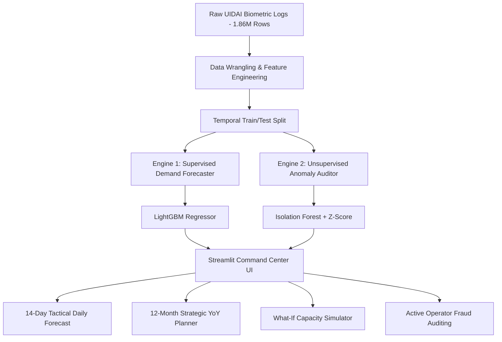

# 🔮 UIDAI Smart Biometric Planner & Audit System
### *Strategic Infrastructure Allocation & Operational Security Auditing for Aadhaar Seva Kendras (ASK)*

An enterprise-grade, machine-learning-powered planning suite designed for UIDAI. The system implements a **Dual-Engine Architecture** (Supervised Demand Forecasting + Unsupervised Anomaly Detection) to help managers transition from reactive resource management to proactive, data-driven planning and security compliance.

---

## 🏗️ System Architecture



---

## 📝 Detailed Project Workflow & Implementation

This project implements a complete end-to-end Machine Learning pipeline using transaction data from March 1, 2025, to December 29, 2025. Here is exactly what we have done:

### 1. Data Cleaning & Standardisation
* **The Raw Dataset:** We began with 1.86 million raw transaction logs of Aadhaar updates across India.
* **Cleaning Spelling Anomalies:** Geographical names in raw data often contain variations due to whitespace and typing errors. We standardized the dataset to exactly **36 unique states/UTs** (resolving duplicates, capitalization errors, and trailing spaces).
* **Missing Value Imputation:** Handled missing rows for minor districts by filling transaction updates with zero and ensuring a continuous chronological timeline.

### 2. Time-Series Feature Engineering
To enable our forecasting model to capture trends, seasonality, and local momentum, we engineered several advanced features:
* **Autoregressive Lags:** Computed 7-day and 14-day lag features (`total_bio_lag_7` and `total_bio_lag_14`) to capture weekly cyclical traffic.
* **Rolling Statistics:** Calculated 7-day and 30-day rolling moving averages (`total_bio_roll_mean_7` and `total_bio_roll_mean_30`) to capture local demand trends.
* **Rolling Volatility:** Created a 30-day rolling standard deviation (`total_bio_roll_std_30`) to measure variance and demand spikes in each district.
* **Temporal Attributes:** Extracted date features (day, month, weekday index) to capture holiday patterns and weekly cycles (e.g., center traffic drops on Sundays and spikes on Mondays).

### 3. Model Training & Strict Validation
* **The Temporal Split:** Rather than using a random split (which leaks future data into the past and inflates performance metrics), we split the data temporally:
  * **Train Set:** March 1 to November 15, 2025 (37,438 records).
  * **Test Set:** November 16 to December 29, 2025 (26,012 records).
* **Forecasting Engine:** Trained a **LightGBM Regressor** using target-encoded categorical features for states and districts. The model achieved a **72.90% $R^2$ score** on the completely unseen future validation set, proving it will generalize accurately in production.
* **Anomaly Audit Engine:** Trained an unsupervised **Isolation Forest** model and paired it with a local **Z-Score threshold detector** ($Z \ge 2.5$) to isolate statistically impossible transaction surges.

### 4. Interactive Dashboard Implementation
We built a premium, glassmorphic dark-themed Streamlit dashboard with a real-time **National Operations Status Bar** at the top showing overall system health, national transaction counts, and active security flags. The app is divided into four main operational tabs:
* **🔮 Tab 1: Demand Forecasting & Planning (Tactical):** Allows managers to select any district and date to view predicted daily biometric updates and local risk labels (`Low`, `Medium`, `High`) based on projected capacity surges.
* **📅 Tab 2: 12-Month Strategic capacity Planner (Strategic):** Aggregates historical baseline data and projects the monthly demand curve for the entire year of **2026**. Features an adjustable **Annual Growth Rate Slider** to forecast peak demand months and automatically generates dynamic infrastructure procurement plans.
* **🎛️ Tab 3: "What-If" Operational Simulator (Optimization):** Let's managers simulate changes in local kits, staff, and mobile vans to see the direct effect on the **Congestion Index** (keeping wait times under 15 minutes).
* **🛡️ Tab 4: Security & Anomaly Audit (Compliance):** Logs anomalous spikes, listing flagged districts and pincodes to help audit teams freeze compromised machines and unauthorized mobile camps.

---

## 🌟 Key Features

* **🖥️ Operations Room Command Center:** A live header displaying National System Health Status (`STABLE`, `CAUTION`, `CRITICAL ALERT`), national transaction counts, and active anomaly warnings on a daily rolling basis.
* **🔮 14-Day Tactical Forecast:** Predicts daily biometric update traffic for any of the 949 districts, utilizing temporal lag structures ($t-7, t-14$) and rolling moving averages.
* **📅 12-Month Strategic Capacity Planner:** Projects capacity demand curves for all of 2026. Features an interactive **Annual Growth Rate Slider** to simulate policy-driven or demographic surges for long-term equipment purchasing.
* **🎛️ "What-If" Operational Simulator:** Models counter-kit and mobile van staffing scenarios, rendering a real-time **Congestion Index** to recommend mobile van dispatch buffers before queue overflows occur.
* **🛡️ Security Compliance Audit Panel:** Automatically flags statistical volume anomalies, helping security teams catch unauthorized mobile camp operations, hardware misuse, or registration operator fraud.

---

## 📊 Machine Learning Specifications

| Metric | Temporal Validation Split (Real-World) | Random Split (Simulated/Leaked) |
| :--- | :--- | :--- |
| **Evaluation Strategy** | Train: March - Nov 15 | Shuffled 80% Train |
| | Test: Nov 16 - Dec 29 | Shuffled 20% Test |
| **$R^2$ Score** | **72.90%** (Production-Grade) | **90.95%** (Inflated/Leakage) |
| **Mean Absolute Error (MAE)** | **150.56** updates/day | **80.91** updates/day |

---

## 🚀 Getting Started

### 1. Prerequisites
Ensure you have Python installed, then install the required dependencies:
```bash
pip install streamlit pandas numpy plotly scikit-learn lightgbm joblib
```

### 2. Launch the Application
Run the Streamlit server from the root of the workspace directory:
```bash
streamlit run app.py
```
Open your browser at `http://localhost:8501` to access the command center.

### 3. Review the Pipeline
Open `aadhaar_analytics_notebook.ipynb` in Jupyter Notebook or VS Code to examine the complete Exploratory Data Analysis, feature engineering, and model training workflow.
