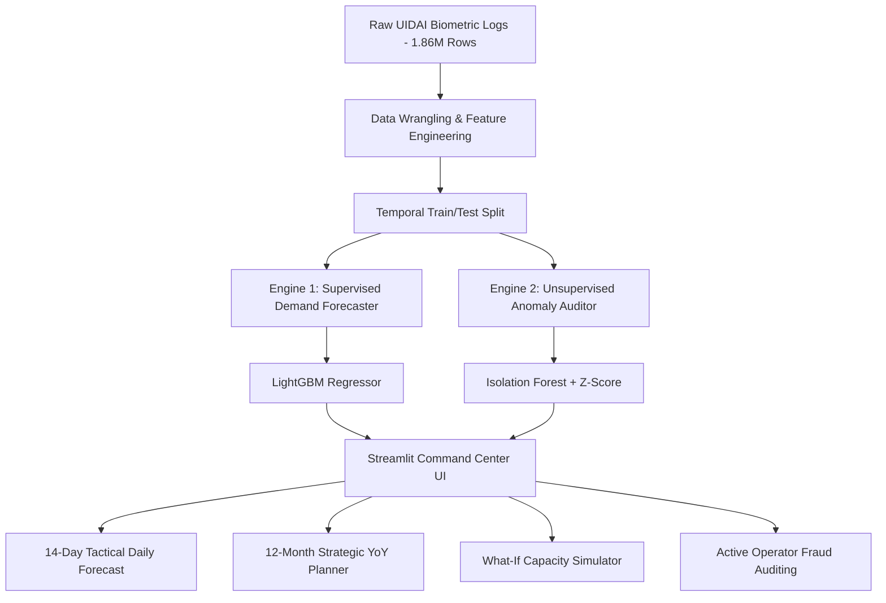

# 🔮 UIDAI Smart Biometric Planner & Audit System
### *Strategic Infrastructure Allocation & Operational Security Auditing for Aadhaar Seva Kendras (ASK)*

An enterprise-grade, machine-learning-powered planning suite designed for UIDAI. The system implements a **Dual-Engine Architecture** (Supervised Demand Forecasting + Unsupervised Anomaly Detection) to help managers transition from reactive resource management to proactive, data-driven planning and security compliance.

---

## 🏗️ System Architecture



---

## 🌟 Key Features

* **🖥️ Operations Room Command Center:** A live header displaying National System Health Status (`STABLE`, `CAUTION`, `CRITICAL ALERT`), national transaction counts, and active anomaly warnings on a daily rolling basis.
* **🔮 14-Day Tactical Forecast:** Predicts daily biometric update traffic for any of the 949 districts, utilizing temporal lag structures ($t-7, t-14$) and rolling moving averages.
* **📅 12-Month Strategic Capacity Planner:** Project capacity demand curves for all of 2026. Features an interactive **Annual Growth Rate Slider** to simulate policy-driven or demographic surges for long-term equipment purchasing.
* **🎛️ \"What-If\" Operational Simulator:** Models counter-kit and mobile van staffing scenarios, rendering a real-time **Congestion Index** to recommend mobile van dispatch buffers before queue overflows occur.
* **🛡️ Security Compliance Audit Panel:** Automatically flags statistical volume anomalies, helping security teams catch unauthorized mobile camp operations, hardware misuse, or registration operator fraud.

---

## 📊 Machine Learning Specifications

Unlike standard projects that use random splits (which suffer from temporal data leakage and inflate validation metrics), this project enforces strict **Temporal Validation Split** to reflect real-world viability.

| Metric | Temporal Validation Split (Real-World) | Random Split (Simulated/Leaked) |
| :--- | :--- | :--- |
| **Evaluation Strategy** | Train: March - Nov 15 | Shuffled 80% Train |
| | Test: Nov 16 - Dec 29 | Shuffled 20% Test |
| **$R^2$ Score** | **72.90%** (Production-Grade) | **90.95%** (Inflated/Leakage) |
| **Mean Absolute Error (MAE)** | **150.56** updates/day | **80.91** updates/day |

* **Supervised Forecaster:** LightGBM Regressor utilizing target-encoded geographical entities and temporal lag features.
* **Unsupervised Security Auditor:** Isolation Forest + Rolling Z-Score outlier detection.

---

## 📁 Repository Directory Layout

The project follows a clean, modular structure:

```text
├── data/
│   ├── cleaned_biometric_data.csv       # Standardized daily transaction dataset
│   ├── district_features.csv            # Engineered lag and rolling statistics
│   ├── pincode_hotspots.csv             # Hyper-local updates aggregation
│   └── api_data_aadhar_biometric_*.csv  # Raw data source splits
│
├── models/
│   ├── demand_forecaster.pkl            # Trained LightGBM regressor
│   ├── anomaly_detector.pkl             # Trained Isolation Forest model
│   └── category_mappings.pkl            # Target-encoded label mappings
│
├── plots/
│   ├── model_performance_comparison.png # ML validation charts
│   ├── monthly_seasonality.png          # Visual EDA seasonality curve
│   └── top_10_states_updates.png        # Geospatial summary plot
│
├── app.py                               # Streamlit Command Center UI
└── aadhaar_analytics_notebook.ipynb     # Complete ML Pipeline (EDA -> Train -> Export)
```

---

## 🚀 Getting Started

### 1. Prerequisites
Ensure you have Python installed, then install the required dependencies:
```bash
pip install streamlit pandas numpy plotly scikit-learn lightgbm joblib
```

### 2. Launch the Application
Run the Streamlit server from the root of the workspace directory:
```bash
streamlit run app.py
```
Open your browser at `http://localhost:8501` to access the command center.

### 3. Review the Pipeline
Open `aadhaar_analytics_notebook.ipynb` in Jupyter Notebook or VS Code to examine the complete Exploratory Data Analysis, feature engineering, and model training workflow.
